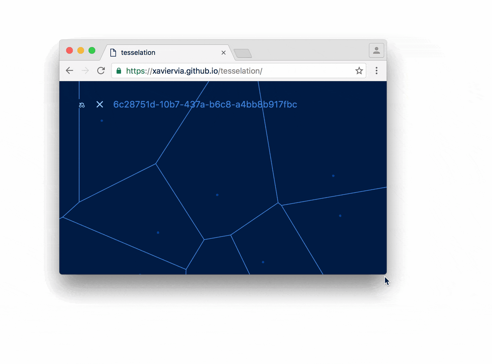
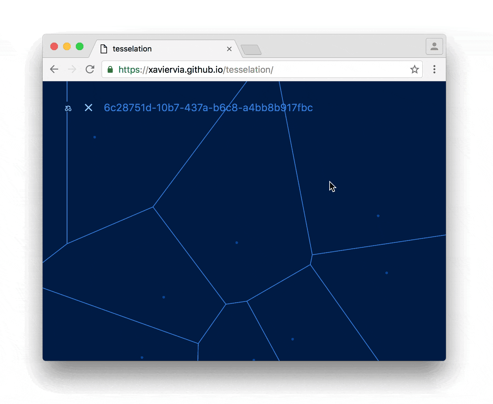
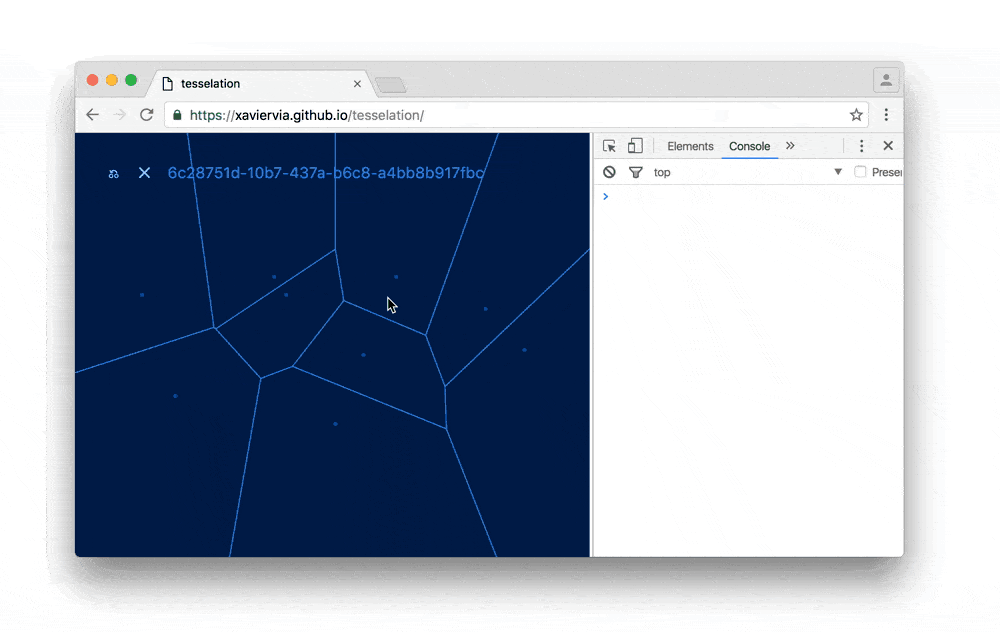
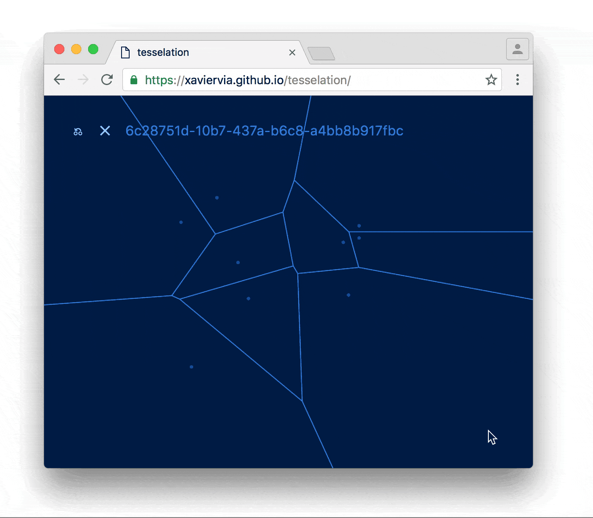
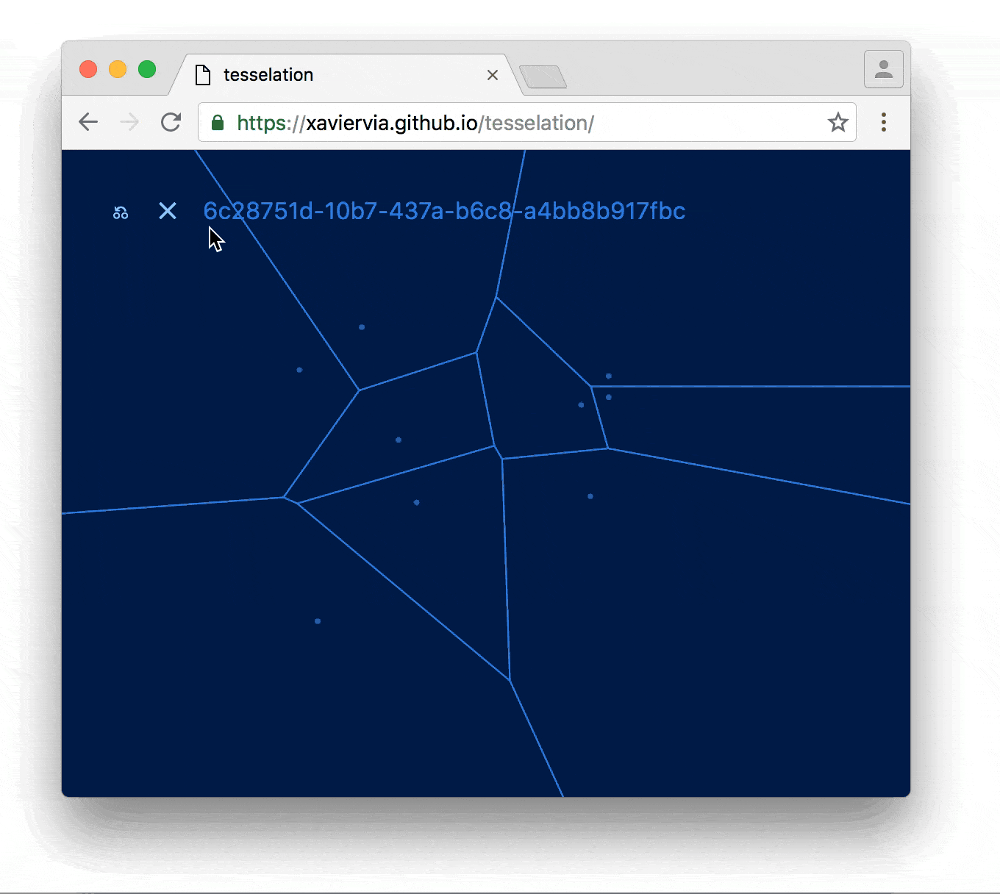
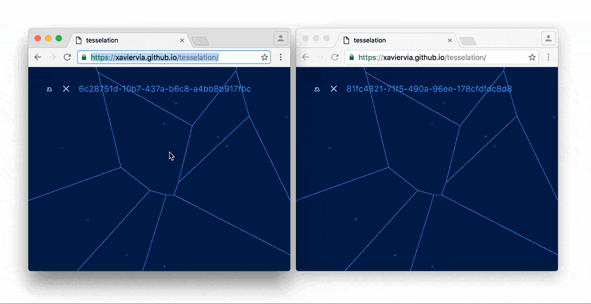
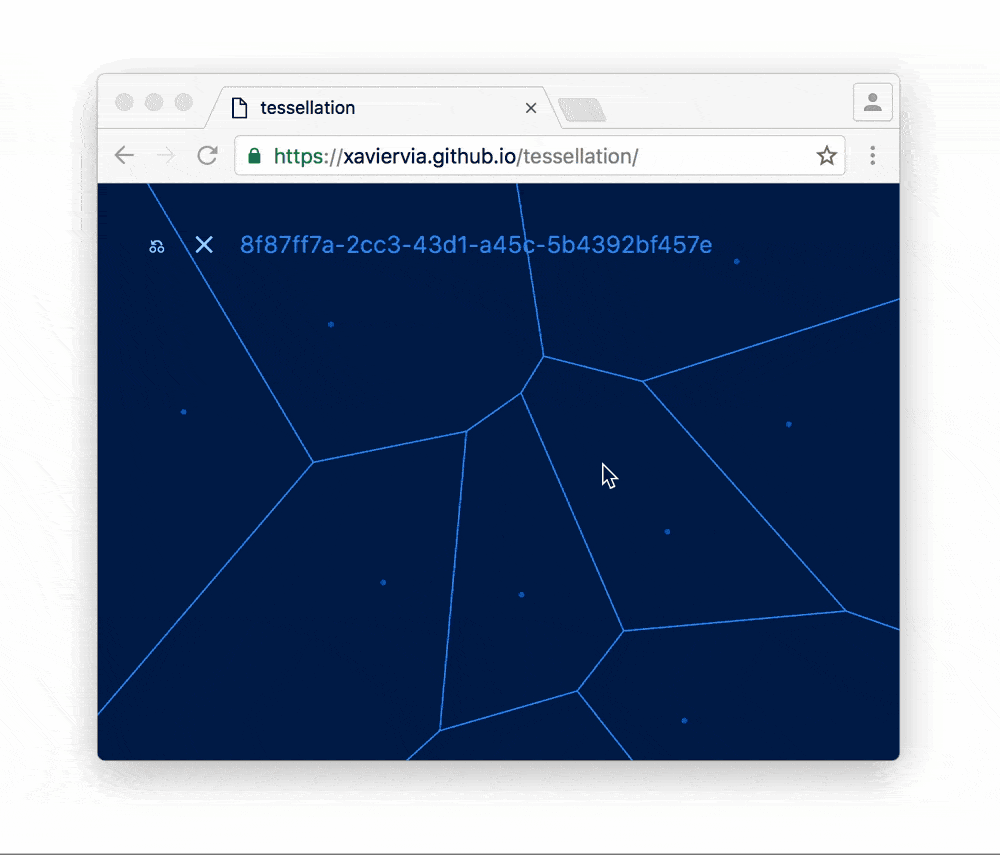
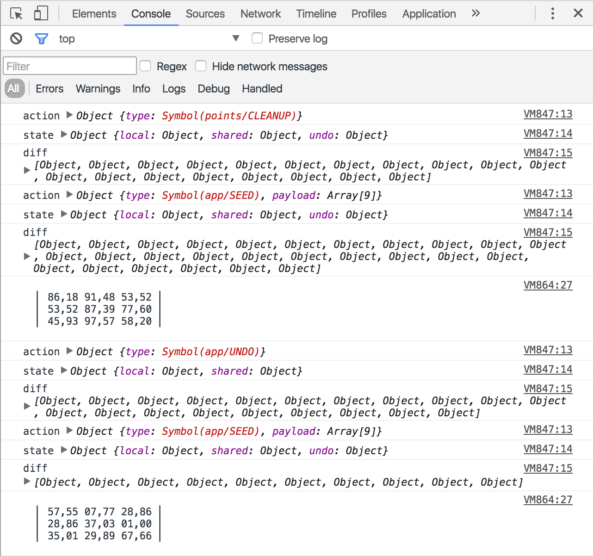

# Tessellation (thesis)

> v1.0.0 . See the live application in [https://xaviervia.github.io/tessellation/](https://xaviervia.github.io/tessellation/)


> This app was tested and intended for a recent version of Chrome. It might not work somewhere else.

This project is a thesis on how to build front end applications.

**Tessellation** is a simple but not trivial application that keeps a set of points in the state and renders them as a [Voronoi tessellation](https://en.wikipedia.org/wiki/Voronoi_diagram) with a little help from [d3](https://d3js.org/) and [React](https://facebook.github.io/react/).

## Contents

- [Features of the demonstration application](#features-of-the-demonstration-application)
- [Principles](#principles)
- [Let's get stated](#lets-get-started)
  1. [Reloading](#1-reload-the-application)
  2. [Resizing](#2-resize-the-window)
  3. [Clicking around](#3-click-around)
  4. [Checking the console](#4-open-the-console-and-click-around)
  5. [Undoing](#5-click-the--undo-button)
  6. [Reseeding](#6-click-the--reseed-button)
  7. [Synchronization](#7-see-two-windows-synchronized)
- [Core application logic](#core-application-logic)
- [High order reducers](#high-order-reducers)
- [Effects](#effects) –– the [Effect Wiring API](#effect-wiring-api) if of special importance.
- [Debugging](#debugging)
- [Libraries](#libraries)
- [Gotchas and easter eggs](#gotchas-and-easter-eggs)
- [My personal takeaways](#my-personal-takeaways)
- [Credits and references](#credits-and-references)
- [License](#license)

## Features of the demonstration application

- Saves automatically to local storage.
- Synchronizes across browser tabs/windows.
- Logs updates to the console.
- Renders a SVG diagram and allows you to interact with it.
- Seeds the state with random data.

The point is to explore a simple way of dealing with distinct types of side effects. These side effects are real requirements of many front end applications.

They also cover the full spectrum of [effect directionalities](#effect-directionality), so in theory any side effect could be implemented with the same APIs. More on that later.

## Principles

- The [core application logic](#core-application-logic) is purely functional: that is, it's done entirely with pure functions, and it's implemented using functional programming patterns.
- The core application logic [is composable](#composing-the-state-management-logic-from-smaller-pieces).
- [Side effects](#effects) are wired to the state using a reactive programming approach.
- All side effects are treated in the same way.
- Few libraries are used and they are used as little as possible.

### A note on the status of this thesis

Please take this at face value and don't assume that I'm completely sold on the ideas put together here. Tessellation is an experiment, and while I'm rather happy with the results, there are no simple answers in programming. It will also likely evolve, and if that's the case I'll continue publishing the new versions as I refine the ideas that make up the architecture.

## Let's get started

First, open the live app in [https://xaviervia.github.io/tessellation/](https://xaviervia.github.io/tessellation/).

You are watching a very simple example of a [Voronoi tessellation](https://en.wikipedia.org/wiki/Voronoi_diagram), a kind of cell diagram automatically generated from points spread across a plane. There are 9 points in total.

If this is the first time you open the application, the distribution of dots that you see is random, and was generated by the [Seed](#seed) effect.

Let's play around:

### 1. Reload the application


The distribution of dots doesn't change! This is because each time the state is updated, the new distribution of dots is saved by the [LocalStorage effect](#localStorage) into, well, `localStorage`. When you reload, the same LocalStorage effect recovers the points from there.

### 2. Resize the window



The tessellation changes it's proportions to fit the new window size. Each time you resize the window, the [Resize effect](#resize) pushes a new action. The app recalculates the positions of the dots and lines by skewing the 100x100 grid.

### 3. Click around



One dot is removed, and another dot is added in roughly the position where you clicked.

> It will be placed _roughly_ where the mouse was because positions are normalized from whatever size your window is to a 100x100 grid, so the application's grid doesn't match the pixels that you see. This action is sent from the [View effect](#view)––which is a React component.

### 4. Open the console and click around



Each new distribution of dots is logged to the console. The [Log effect](#log) is responsible for this.

Try clicking several times in the same place without moving the mouse: you will see that the distribution of dots is printed only once. The state management part of the application is taking care of not sending the same state twice to the effects. We will [see this later in more detail](#putting-it-all-together).

### 5. Click the `⎌` (undo) button



The point distribution goes back to the previous one. How this is achieved is an interesting part of the state manipulation and [state logic composition](#composing-the-state-management-logic-from-smaller-pieces) exploration.

### 6. Click the `✕` (reseed) button



A new random distribution of dots appears.

### 7. See two windows synchronized



Finally, open another browser window, go to [https://xaviervia.github.io/tessellation/](https://xaviervia.github.io/tessellation/), put it side by side with the current one, and click around in one and the other: you would see that both update at the same time, completely synchronized. This is also done by the [LocalStorage effect](#localstorage)

> There is a bug caused by a race condition that you can trigger having the windows side by side. We will discuss it later, but see if you can find it if you want.

## Core application logic

The application logic is contained in the files placed directly under the `src` and the `src/reducers` folders.

- [`actions.js`](src/actions.js) contains the constant declarations for the action types. I'm trying out using Symbols for action types constants. Symbols make for great action types because each Symbol is totally unique, which means that collision between them is impossible. I took inspiration for this from [Keith Cirkel's Metaprogramming in ES6: Symbol's and why they're awesome](https://www.keithcirkel.co.uk/metaprogramming-in-es6-symbols/). Take this with a grain of salt: I haven't tried it outside Chrome or in a real life app.

- [`index.html`](src/index.html) is the HTML entry point. [Sagui](https://github.com/saguijs/sagui) will configure [Webpack](https://webpack.github.io/) to load it with the corresponding `index.js`.

- [`index.js`](src/index.js) is the JavaScript entry point. It's the only place where the effects meet the store, and the place where the application wiring is done. Note that, unlike in many other React applications, the `index.js` is _not in charge of rendering_: rendering the view is considered just another effect. Rendering is not part of the core of the application.

  > This doesn't mean that rendering is not _important_. As stated below, [effects are the whole point of an application](#effects). Saying that rendering is not part of the core means only that rendering is not state management logic.

- [`lenses.js`](src/lenses.js) is the only file that is, to some extent, a **Ramda** artifact. Ramda provides this really cool functionality for selecting values in nested object structures that is done via [`lensPath`](http://ramdajs.com/docs/#lensPath) functions, which combined with [`view`](http://ramdajs.com/docs/#view) and [`set`](http://ramdajs.com/docs/#set) make for great ways of querying and immutably setting values in a complex state object. I still haven't decided what to do with this file.

- [`selectors.js`](src/selectors.js) contains the functions that make it easy to query the state blob.

- [`store.js`](src/store.js) contains the initial state blob and the reducer, which is in turn built from all the high order reducers in `reducers/`.

- [`reducers/`](src/reducers) contains files with each of the high order reducers.

It's important to notice that, with the exception of `index.js`, **all of the above contain only pure functions**. There is nothing weird going on in them, and any complexity in the code is derived mostly from the complexity of the application functionality itself. I consider this one of the biggest achievements of this proposed architecture.

> The [`debuggable`](src/reducers/debuggable.js) high order reducer is not pure, but the intent of that function is just to introspect the state while in development, so it doesn't really count.

The whole application state is contained in a single object blob, Redux style. Actually, the whole architecture is heavily inspired by Redux––with two differences:

- To prove that the "single object" state approach trascends libraries and it's easily reproducible with any reactive programming library, Tessellation is not using Redux itself.
- Tesselation's store is highly decoupled from the UI: Redux was originally meant to represent the data necessary to drive the UI, and the patterns that emerged around it reflect that intent. The thesis here is that the way Redux drives state can be used to manage any type of side effect, and for that purpose I introduced a generalized wiring interface that––so the argument goes––can be used for **any** side effect.

To emphasize that the architecture is meant to be a generalization of Redux and not another Flux implementation––as in, another way of doing React––the nomenclature is slightly different:

- `dispatch` is called `push` to represent the fact that the actual operation of dispatching an action is analogous to pushing into an array structure. As a matter of fact, it's pushing data into a stream that gets reduced on each addition – or `scan`ned in Flyd lingo.

- There is no `getState`. State is pushed to the effects as an object each time the store gets updated.

### Composing the state management logic from smaller pieces

Redux reducer composition is sometimes done with the [`combineReducers`](http://redux.js.org/docs/api/combineReducers.html) utility. `combineReducers` segments the state into several disconnected namespaces that the reducers target separately. In the past I had real problems with this approach: long story short, keeping reducers from affecting each other lead me and my colleagues to manufacture artificial actions whose only purpose was allow some reducers to affect parts of the state outside their namespace. I even [built a middleware for that](https://github.com/xaviervia/redux-walk). It was messy. I take it as a cautionary tale.

The documentation itself warns us that `combineReducers` [is just a convenience](http://redux.js.org/docs/api/combineReducers.html#tips). Me and my colleagues eventually noticed that, and since then I explored alternative ways of working with several reducers.

I came to favor a very different approach:

## High order reducers

In this project I wanted to explore composition of reducers using a pattern that I saw presented in React Europe for [undoing](https://github.com/omnidan/redux-undo): high order reducers. In a nutshell, it means that instead of implementing your most basic reducer as:

```javascript
const reducer = (state, action) => {
  switch (action.type) {
    case 'ADD':
      return state + 1

    default:
      return state
  }
}
```

…you take another reducer as the first argument and pass it through when you are not interested in the current action:

```diff
- const reducer = (state, action) => {
+ const highOrderReducer = (reducer) => (state, action) => {
  switch (action.type) {
    case 'ADD':
      return state + 1

    default:
-      return state
+      return reducer(state, action)
  }
}
```

The advantages are plenty, but the main hidden one I found is that is very natural to make your high order reducers parametrizable, which means they can be _reusable_. In a silly example, let's say that you want to reuse the above shown _addition_ reducer, and in each specific application you want to use a different name for the action type and a different name for the property of the state that has to be affected. Then you could write your HOR (High Order Reducer) as follows:

```javascript
const additionHighOrderReducer = (property, actionType) => (reducer) => (state, action) => {
  switch (action.type) {
    case actionType:
      return {
        ...state,
        [property]: state[property] + 1
      }

    default:
      return reducer(state, action)
  }
}
```

The other obvious advantage is that a HOR can manipulate the result of another reducer, introducing the intriguing possibility of performing meta actions on the state.

### The undoable high order reducer

The following is the very simple implementation of the adding support for the _undo_ operation with a high order reducer. It can be found in [`src/reducers/undoable.js`](src/reducers/undoable.js):

```javascript
export default (actionType) => (reducer) => (state, {type, payload}) => {
  const {undo, ...restOfState} = state

  switch (type) {
    case actionType:
      return state.undo

    default:
      const newState = reducer(state, {type, payload})

      return newState !== state
        ? {
          ...newState,
          undo: restOfState
        }
        : newState
  }
}
```

Notice how the `default` action runs the reducer that it received as an argument and checks if the result differs from the previous state. In case it is different, it will not just return the new state: it will also add an `undo` property to the new state––with a reference to the old state. To perform the undo operation, it's as simple as returning `state.undo`.

### High order reducer composition

`undoable` demonstrates the kind of power that HORs bring, but of course not all HORs need to be meta: HORs are valuable because you can chain them into a single reducer. You can't do this with plain reducers.

How would that composition look like? Well, simple enough:

```javascript
const reducer = compose(
  undoable(APP_UNDO),
  appHOR,
  pointsHOR
)((x) => x)
```

Note that:

1. Keep in mind that to get an actual reducer out of a HOR, you need to call it with another reducer. The simplest possible reducer is the **identity function**––that is, the function that returns whatever argument it gets. Think about it: a reducer that gets a state and returns that same state is still a reducer.

  We could build the composition with an useful reducer instead of using identity, but that would break the symmetry of the whole thing, since one of the parts of the application will not be a HOR.

2. Since the `undoable` HOR intercepts the result of the other reducers, it needs to be the last element of the composition. Otherwise it would only operate on the identity function. Remember: `compose` works from right to left, so the above expression translates to:

  ```javascript
  const reducer = undoable(APP_UNDO)(appHOR(pointsHOR((x) => x)))
  ```

> You can see a variation of this in `src/store.js`. The actual implementation is more complex because it requires the full action dictionary to be passed in to each high order reducer: but that's an implementation detail of which I'm not completely sure about.

Any number of HORs can be chained in this way. Hopefully we can explore this further: it may be that, by adding configuration detailing what properties of that state tree the HORs should modify and what action types they should respond to, it becomes possible to have truly reusable pieces of application logic.

## Effects

Now to the fun part.

The application store can be seen as a _stream_, a stream that gets updated each time that something is pushed into it, and then gets split into several other streams that get finally sent down to the different side effects.

That is the conceptual picture: the actual implementation will vary. For example: while this schema is a good analogy of how Redux works, the Redux store is not an actual reactive stream, and even in this application the store stream is not literally split and sent down to the effects. But the analogy still holds.

> Here comes a semantic side note: I'm calling these _effects_ instead of _side effects_ because, as many pointed out, an application without side effects is just a way of transforming electricity into heat. _Effects_ is a correct name: the purpose of applications is in fact to perform effects. Side effects on the other hand refer to the _unintended consequences_ of performing an otherwise functional operation. In informal contexts I will use _effect_ and _side effect_ interchangeably, but I'll try to stick to _effects_ whenever nomenclature is important.

### Effect directionality

Effects come in different flavors:

- **Incoming**: Effects that only inject data into the application. [Resize](#resize-effect) and [Setup](#setup-effect) are examples of this type.

- **Outgoing**: Effects that react to the new state by performing some operation, but never inject anything back. [Log](#log-effect) is an Outgoing Effect.

- **Bidirectional**: Effects that react to the state _and_ inject information back into it via actions. [LocalStorage](#localstorage-effect), [Seed](#seed-effect) and [View](#view-effect) are of this type.

Notice that there is no implication whatsoever that incoming and outgoing effects need to be synchronous. As a matter of fact, incoming effects are like hardware interruptions: they come from the outside world at an arbitrary time. This is how the architecture proposed here manages asynchronous operations: if the result of the operation is important to the application state, an asynchronous effect will capture some state change and perform some operation somewhere, only to push an action back into the state whenever (and if) the operation is completed. Notice that as far as the application state is concerned, the temporality between those two events is completely irrelevant.

> You can easily imagine constructing REST requests with this approach: say that a blog post was just submitted by the user: somewhere in the application state, there will be a sign that the REST communication effect will read and realize that a backend call needs to be performed: when that backend call is completed, it will push an action into the state signifying that the post was saved, or that a retry is necessary.
>
> But I digress.

Categorizing the effects into these three types is not terribly useful: knowing if an effect is **Incoming**, **Outgoing** or **Bidirectional** doesn't say much about what it does. The reason I talk about it is because it sheds some light into why the Effect Wiring API looks like it does.

### Effect Wiring API

Effects are wired to the store with a simple API: each effect is a function with the signature––in [Flowtype annotations](https://flowtype.org/):

```javascript
type FluxAction = {
  type: Symbol,
  payload: any
}

type Effect = (push: (action: FluxAction) => void) => ?(state: any) => void
```

Logging to the console each time the state is updated is easy enough:

```javascript
export default () => (state) => console.log(state)
```

Another thing that you can do is to push an action when the application is being set up. This is useful for initializing values on startup. In this case we can use a little API sugar: since the `(state: any) => void` part of the signature is optional (preceded by a `?`) we can push directly:

```javascript
import {RANDOM_VALUE} from 'actions'

export default (push) => {
  push({
    type: RANDOM_VALUE,
    payload: Math.random()
  })
}
```

### LocalStorage effect

> [code](src/effects/localStorage.js)

```javascript
import {APP_SYNC} from 'actions'

export default (push) => {
  // Right after invocation, it checks if there is an entry in `localStorage`
  // for `tessellation`, and if there is, it immediately pushes an action
  // with the previously saved state.
  if (window.localStorage.getItem('tessellation')) {
    push({
      type: APP_SYNC,
      payload: JSON.parse(window.localStorage.getItem('tessellation'))
    })
  }

  // It sets up a listener on the window `storage` event, and whenever the
  // `tessellation` entry is updated it pushes another state override,
  // thus keeping it in sync with whatever other instance of the
  // application is running in a different window or tab.
  window.addEventListener('storage', ({key, newValue}) => key === 'tessellation' &&
    push({
      type: APP_SYNC,
      payload: JSON.parse(newValue)
    })
  )

  // Whenever there is a new state, it serializes it and stores it
  // in `localStorage`
  return (state) => window.localStorage.setItem(
    'tessellation',
    JSON.stringify(state.shared)
  )
}
```

The cross window/tab synchronization will conspire with another effect and [come back to bite us in the gotchas](#gotchas-and-easter-eggs).

### Log effect

> [code](src/effects/log.js)

Logs the current points with a nice format.

```javascript
import leftPad from 'left-pad'
import {point} from 'selectors'
import {compose, join, map} from 'ramda'

const p = (index) => compose(
  join(','),
  map((value) => leftPad(value, 2, 0)),
  point(index)
)

export default () => (state) => point(0)(state) &&
  console.log(
`
  ⎢ ${p(0)(state)} ${p(1)(state)} ${p(2)(state)} ⎢
  ⎢ ${p(2)(state)} ${p(4)(state)} ${p(5)(state)} ⎢
  ⎢ ${p(6)(state)} ${p(7)(state)} ${p(8)(state)} ⎢

`
)
```

### Resize effect

> [code](src/effects/resize.js)

```javascript
import {APP_RESIZE} from 'actions'

export default (push) => {
  // It immediately sets the size data
  push({
    type: APP_RESIZE,
    payload: {
      height: window.innerHeight,
      width: window.innerWidth
    }
  })

  // Sets up a listener so that each time that the window gets
  // resized an action is pushed with the new window size value
  window.addEventListener('resize', () => push({
    type: APP_RESIZE,
    payload: {
      height: window.innerHeight,
      width: window.innerWidth
    }
  }))
}
```

### Seed effect

> [code](src/effects/seed.js)

If the state doesn't already have any points, it seeds the application with 9 random points.

```javascript
import {map, range} from 'ramda'
import {APP_SEED} from 'actions'

const {floor, random} = Math

// This effect needs to be loaded last
// to avoid colliding with any state recovered from localStorage
export default (push) => (state) => state.shared.points.length === 0 &&
  push({
    type: APP_SEED,
    payload: map(
      () => [floor(random() * 100), floor(random() * 100)],
      range(0, 9)
    )
  })
```

### Setup effect

> [code](src/effects/setup.js)

When initialized, it immediately pushes an action with a newly generated UUID to identify the instance of the application. There is an interesting gotcha here: I initially modeled this as being part of the `initialState` object in the `store`, but you can see how that violates the purity of the store implementation.

It's a common temptation to perform "one off" side effects in the creation of the `initialState`, but doing that means that the initial state is no longer deterministic, which in turn is likely to create problems down the line. It's a good litmus test for the store implementation that no libraries with side effects are used within it.

```javascript
import uuid from 'uuid'
import {APP_SETUP} from 'actions'

export default (push) => {
  push({
    type: APP_SETUP,
    payload: {
      id: uuid.v4()
    }
  })
}
```

### View effect

> [code](src/effects/view.js)

> Too long to display inline

The view effect is simply a React component that is rendered using ReactDOM into the actual DOM tree. The little d3 magic responsible for getting the polygon information for the Voronoi diagram lies in there, but other than that it's a pretty regular React component. And that's the point here: the React integration doesn't look weird in any way, but also it doesn't look different from the integration of any other effect.

The interesting part in the React component is the small wiring that is done to tie the state of the Container component with the state passed in from the outside:

```javascript
let onState

class Container extends Component {
  componentDidMount () {
    onState = (state) => this.setState({
      storeData: state
    })
  }

  render () {
    if (this.state == null) {
      return false
    }

    const {storeData} = this.state
    ...
  }
}

...

return onState
```

That is literally it. The `onState` function is defined on `componentDidMount`, and it's set up to update the `storeData` property of the Container state each time that the application calls it. React will realize if the state actually changed, and inside the `render` function it's just a matter of checking for the state being defined or not (which could easily be avoided by setting an initial state, but I didn't want to cater for that scenario) and then the whole store state is available, one deconstruction away, in `storeData`. Selectors can be readily used to query that data.

For pushing information back into the state, this is what we do:

```javascript
<Button
  onClick={() => push({ type: POINTS_CLEANUP })}
  title='reseed'>
  ✕
</Button>
```

Again, nothing differs between this and how any other effect is wired.

Other components that are not the container can (and should) be kept generic. Sending push or "untreated" chunks of the state down the React tree is a _nasty antipattern_, but this is also true when sending `dispatch` and/or `getState` in React Redux, so there is nothing new under the sun here.

## Putting it all together

aka recreating Redux in three lines of Flyd code.
TODO: Explain the index.js (any maybe clean it up)


## Debugging

How do I get something like the magnificent [Redux Chrome DevTools](https://github.com/zalmoxisus/redux-devtools-extension)?

I'm glad you ask. Actually, you can't get exactly that. The tools and documentation accompanying Redux are a great achievement of the developers and an excellent reason to keep using Redux in the short and middle term.

However! It's pretty easy to get useful debug information about the evolution of the state in any architecture that uses reducers as the cornerstone of state management. In the reducers folder, there is `debuggable` HOR that can be used to decorate our reducer function and get more insights.

The implementation of `debuggable` is also _very_ simple:

```javascript
import {diff} from 'jiff'

export default (reducer) => (prevState, action) => {
  const nextState = reducer(prevState, action)

  console.log('action', action)
  console.log('state', nextState)
  console.log('diff', diff(prevState, nextState))

  return nextState
}
```

There are instructions for easily enabling this debugging in the `src/index.js`. If you want to try it out:

1. `git clone git://github.com/xaviervia/tessellation`
2. `cd tessellation`
3. `npm install`
4. In your editor, open the `src/index.js` and uncomment lines `4` and `12`, as instructed. Comment out line `10`
5. `npm start`
6. Open [http://localhost:3000](http://localhost:3000)

Extending this debugging tool should be rather straightforward.

## Libraries

Several libraries used throughout this project. The architecture is built so that none of these is indispensable to the underlying thesis. Don't get too fixated on the choice of libraries––libraries change depending on the context, while hopefully the overall approach will not.

### Functional: [Ramda](ramdajs.com)

Ramda is the Swiss army knife of the functional programming community in JavaScript. It supports a close analog of the [Prelude](https://hackage.haskell.org/package/base-4.9.0.0/docs/Prelude.html) standard library of [Haskell](https://www.haskell.org/), and takes type signatures, performance, consistency and the functional principles seriously. It provides a good foundation of functions that is lacking in the JavaScript standard library. This makes it extremely useful for building applications using functional programming principles.

That said, plain modern ES (which you can get with the [Babel polyfills](https://babeljs.io/docs/usage/polyfill/)) already contains a fair subset of Ramda's functions. You can also find many of the same functions in [lodash](https://lodash.com/), [1-liners](https://github.com/1-liners/1-liners), etc.

### Reactive: [Flyd](https://github.com/paldepind/flyd)

Flyd is the most minimalistic and elegant reactive programming library that I could find. It provides an extremely easy way of creating streams and no-nonsense way of dealing with them. It follows the [fantasy-land](https://github.com/fantasyland/fantasy-land) specification, which means Flyd streams interoperate fantastically with Ramda (although I'm not making use of that at all in this project).

There are many alternatives to Flyd out there. For the architecture suggested here, the most relevant might be [Redux](http://redux.js.org) itself, but if you are looking for a more complete reactive programming toolkit you can take a look at [most](https://github.com/cujojs/most) or [Rx](https://github.com/Reactive-Extensions/RxJS).

### Rendering: [React](https://facebook.github.io/react/)

I'm assuming React needs no introduction. The point here is that **not even React** is necessary for this architecture to work. Of course, as long as the side effects are treated as functions that are called every time that new state is generated, using a reactive UI library will make the implementation simpler.

React is not the only tool around for that: you can also try out [Preact](https://github.com/developit/preact), [Act](https://github.com/act-framework/act), or [virtual-dom](https://github.com/Matt-Esch/virtual-dom), among many others.

## Gotchas and easter eggs

The application has two bugs that were left there to demonstrate the kind of quirks that can emerge out of this architecture, and I will discuss here possible solutions.

### “Reseed then undo” bug



Pay close attention to the tiles before the **Reseed** button is pressed and the ones right after pressing **Undo** and you will notice that they are not the same. But they should be: you are undoing to the state before reseeding.

What went wrong? Let's enable the `debuggable` HOR and take a look at the action log for this operation:



As you can see, the **app/SEED** and **app/UNDO** are not the only operations happening. Why?

If we take a look at the [implementation of the **Reseed** button](src/effects/view.js#L49):

```javascript
<Button
  onClick={() => push({ type: POINTS_CLEANUP })}
  title='reseed'>
  ✕
</Button>
```

…we can see that it's not **actually** telling the application to reseed. Instead, it's just removing the current points from the state. Turns out that the Seed effect will check the amount of points in the state and, finding that amount is zero, it will repopulate with a random set automatically.

When I implemented the Reseed button action as just an invocation of the **POINTS_CLEANUP** action, I felt clever. I thought:

“Hey, I already have the functionality for re seeding an empty set of points, what if for the reseed button I just **clear the state** and leave that other effect do it's job?”

This was an honest-to-God bug that I introduced when originally building this application, because I couldn’t foresee any issues with cleaning up instead of reseeding directly, and I didn’t want to reimplement the random number generation or extract it out from the Seed effect.

> I could have taken the **cleverness** of the move as a warning sign––on the other hand, reusing the effects is one of the motivations for the writing apps with these kind of architectures. so I wouldn't say that “never being clever" is a solution either.
>
> But I digress.

How does the bug happen? Well, as you can see, being that the Reseed button does not actually **seed** but rather **clears** the points, it is only natural that the undo operation will simply undo the **seeding**, going back to the clean state with no points. This will, in turn, cause the Seed effect to activate and send a freshly baked set of random points again.

How could this be solved?

I can come up with two different strategies for solving this issue. Each has its own merits, but I find the second one more intriguing: it introduces a very state-centric way of thinking about the problem. A way of thinking that would have prevented the clever move from being problematic in the first place.

#### The helper way

> “Extract the random point generator and reuse it in the Reseed button action handler.”

A very obvious solution would be to go to the [`effects/seed.js`](src/effects/seed.js) file:

```javascript
import {map, range} from 'ramda'
import {APP_SEED} from 'actions'

const {floor, random} = Math

// This effect needs to be loaded last
// to avoid colliding with any state recovered from localStorage
export default (push) => (state) => state.shared.points.length === 0 &&
  push({
    type: APP_SEED,
    payload: map(
      () => [floor(random() * 100), floor(random() * 100)],
      range(0, 9)
    )
  })
```

…and extract the number generation as a helper:

```diff
-import {map, range} from 'ramda'
+import getRandomizedPoints from 'lib/getRandomizedPoints'
import {APP_SEED} from 'actions'

-const {floor, random} = Math

// This effect needs to be loaded last
// to avoid colliding with any state recovered from localStorage
export default (push) => (state) => state.shared.points.length === 0 &&
  push({
    type: APP_SEED,
-    payload: map(
-      () => [floor(random() * 100), floor(random() * 100)],
-      range(0, 9)
-    )
+    payload: getRandomizedPoints()
  })
```

…and reuse that helper in the Reseed button:

```diff
<Button
-  onClick={() => push({ type: POINTS_CLEANUP })}
+  onClick={() => push({
+    type: APP_SEED, payload: getRandomizedPoints()
+  })}
  title='reseed'>
  ✕
</Button>
```

The **downside**: a relevant part of the application’s functionality gets lost by being converted into a snowflake helper. While the `getRandomizedPoints` function is reusable in principle, it's unlikely to be useful in any other application. It is not a good abstraction: it's application specific logic hidden away as a helper.

The **upside**: this way of refactoring is familiar. [It's a close analog of Extract Method](http://refactoring.com/catalog/extractMethod.html).

This is not a great upside. If we take familiarity as a litmus test for good architecture, we shouldn't be trying a functional-reactive approach, we should just stick with whatever we were doing before.

#### The state way

I'd love to call this one, “The ironic way”. The idea is to:

> Make randomness deterministic, and complete the seed operation in the reducer for **APP_SEE**

This sounds crazy. The point of randomness is that is not deterministic. Well, not quite.

The point of randomness is that you can't predict it. Determinism is a different matter, and according to your worldview [randomness might not exist or be embedded in everything](https://en.wikipedia.org/wiki/Bohr%E2%80%93Einstein_debates); entropy however **does exist** from an statistical point of view, and it’s what we use to get values that we can’t predict in otherwise predictable systems.

I’ll try not to digress to much, but an important component of [(pseudo)randomness in computer software is mathematical functions](https://en.wikipedia.org/wiki/Pseudorandom_number_generator) that return values between 0 and 1 so that, for any `𝑓(x)`, `𝑓(x + 1)` is not easily predictable. Moreover, if you were to plot a vast amount of values of the pseudo-random number generation function you would not find any discernible pattern, nor be able to extract any statistical clustering of values around a specific number. That is in an ideal world; in reality there are only worse or better approximations.

> While I don’t want to abound in this topic, it is worth noting that unpredictability is a core subject of the work around architectures built to operate with asynchronous interactions with the outside world.

Either way, a pseudo-random number generation function is not random per se: if you send the same sequence of `x`s to it, you get the same values of `𝑓(x)`. This proves useful in real life, since to test the behavior of a program you might want to bombard it with random numbers, but if it fails, you will want to reproduce the random sequence used to see what went wrong. Many pseudo-random number generation libraries provide functions that can be invoked with arbitrary values and will then return **another function** which will produce a sequence of pseudo-random numbers; in these libraries, calling the “factory function” with the same value will result in a set of functions that will produce the same sequence of numbers, every time. This is called **seeding** a pseudo-random number sequence.

Well, turns out that if we could just do that: add a random seed and a counter in the state, then invoke the function the same seed and the counter value to get a pseudo-random number out of it. To get the initial seed (if there is none available from localStorage) we can reuse the application’s window id that we create for the **APP_SETUP**.

First we need a seedable random number generation library. Unfortunately JavaScript doesn’t come with one (`Math.random` is not seedable) but since we are not trying to come up with a trustworthy entropy source that can be used in security or in casinos, we can make do with (a variation of) [Antti Sykäry’s post in Stack Overflow](http://stackoverflow.com/a/19303725/5801727):

```javascript
// New file: src/lib/seedableRandom.js
const {floor, sin} = Math
export default (seed) => (counter) => {
  const x = sin(seed + counter) * 10000
  return x - floor(x)
}
```

Then in the `reducers/app.js`:

```diff
import {set} from 'ramda'

import * as lenses from 'lenses'
+import seedableRandom from 'lib/seedableRandom'

export default (actions) => (reducer) => (state, {type, payload}) => {
  switch (type) {
    case actions.APP_RESIZE:
      return set(
        lenses.size,
        payload,
        state
      )

    case actions.APP_SEED:
-      return set(
-        lenses.points,
-        payload,
-        state
-      )
+      return {
+        ...state,
+        shared: {
+          ...state.shared,
+          // `18` is the amount of numbers that we will use,
+          // two numbers for each dot.
+          counter: (state.shared.counter || 0) + 18,
+          points: map(
+            (index) => [
+              floor(
+                seedableRandom(
+                  state.shared.seed,
+                  state.shared.counter + (index * 2)
+                ) * 100
+              ),
+              floor(
+                seedableRandom(
+                  state.shared.seed,
+                  state.shared.counter + (index * 2) + 1
+                ) * 100
+              )
+            ],
+            range(0, 9)
+          )
+        }
+      }

    case actions.APP_SETUP:
-      return set(
-        lenses.id,
-        payload.id,
-        state
-      )
+      return {
+        ...state,
+        local: {
+          ...state.local,
+          id: payload.id
+        },
+        shared: state.shared.seed
+          ? state.shared
+          : {
+            ...state.shared,
+            seed: payload.id,
+            counter: 0
+          }
+      }

    case actions.APP_SYNC:
      return {
        ...state,
        shared: payload
      }

    default:
      return reducer(state, {type, payload})
  }
}
```

There is some repetition that could be refactored out, but if we were to do that now we can do it as a high order reducer instead of a helper.

The **downsize**: it requires us to understand how pseudo-random number generation works and why `Math.random` is not good enough. This is partially a downsize though: learning this is actually pretty useful.

The **upside**: this approach is far more powerful than the helper one. By moving the logic upstream from the effect to the state, we got the actual generation embedded in the application update function, which means that now any effect can use it.

“But the number generation became coupled with the reducer! Isn’t it better to have it in a decoupled helper!” you say. Yes and no. We can extract a helper to decouple the specific point generation, but it would have to have a signature that allows for it to be used from the reducer. But the fact that is being done in a reducer is absolutely correct. It’s application logic, so it should be part of the state update function one way or another.

Sometimes, decoupling just means **coupling with the right thing**.

### “Sync then reseed” bug

This bug is a variation of the previous one. The fix is the same, because the underlying problem is the same. Why mentioning it at all?

1. This variation of the bug illustrates a race condition: a is typical buggy scenario for applications that synchronize data. While **undo** is a fairly rare feature to support in web applications, synchronization is commonplace. Synchronization issues are more confusing and far harder to debug, so I preferred explaining the issue and the solution with the more discrete manifestation in the “Reseed then undo” form.
2. It illustrates something unrelated but interesting anyway: when things go wild in terms of synchronization, the behavior of applications can be affected by unassuming things such as whether or not the mouse pointer is on top of them. Take a look at the animation carefully (or try it yourself): you will notice that the window where the mouse is being hovered changes slower than the other one. My hypothesis is that the presence of a hovering mouse causes extra computations to be done in the window, effectively slowing down it’s JavaScript thread.
3. It’s kind of pretty.


> The downsize is, even with a reasonable architecture, asynchronous operations are hard. The best we can hope for––at least for now––is to have an architecture that makes it easy to find and solve the issues arising from them.
>
> In imperative architectures, **there are no elegant solution to these issues**. I can't stress this enough: all imperative solutions to this set of problems require some sort of “trusted”, top-of-the-pyramid source of truth that all the nodes recognize as authoritative, or an extra set of events created specifically to indicate that the stream of changes is terminated.


## My personal takeaways

- **Symbols** make for pretty cool action types.
- **High order reducers** open up a world of possibilities for reusable application state management functions.
- The **streams** could be useful in the effects as well. The point here was to keep the API library agnostic and minimize the use of Flyd, but I'm pretty sure streams can help out a lot when dealing with more complex incoming side effects, while still keeping the wiring API agnostic.
- **JSON Patch** diffs can be very useful for debugging and possibly for storing or sharing a log of transformations. For example it could be useful to send the patches over a network to keep clients and servers synchronized.

## Credits and references

- [Redux](http://redux.js.org/) which's "single store" idea heavily inspired this architecture.
- [@joaomilho](https://github.com/joaomilho) who originally gave me the idea of using [`flyd`](https://github.com/paldepind/flyd) to re implement the Redux store, and who's [Act framework](https://github.com/act-framework/act) and [Ion language](https://github.com/ion-lang/ion) motivated the wish to do more and more functional and reactive programming in JavaScript.
- [@Nevon](https://github.com/Nevon)'s [demystifying Redux](https://gist.github.com/Nevon/eada09788b10b6a1a02949ec486dc3ce)

---

- [Sagui](https://github.com/saguijs/sagui) is a great way of bootstrapping and building a modern web application without thinking about configuration.
- [Tachyons](http://tachyons.io/) made the styling a breeze.
- [d3](https://d3js.org)'s heavily mathematical approach made it a great tool to work together with Ramda and React.
- [jiff](https://github.com/cujojs/jiff) is very useful to get JSON diff's between states; diffs that, since they follow the [JSON Patch RFC6902](https://tools.ietf.org/html/rfc6902), can then be applied to the state structure to reproduce the transformation.

## License

[The Unlicense](LICENSE)
