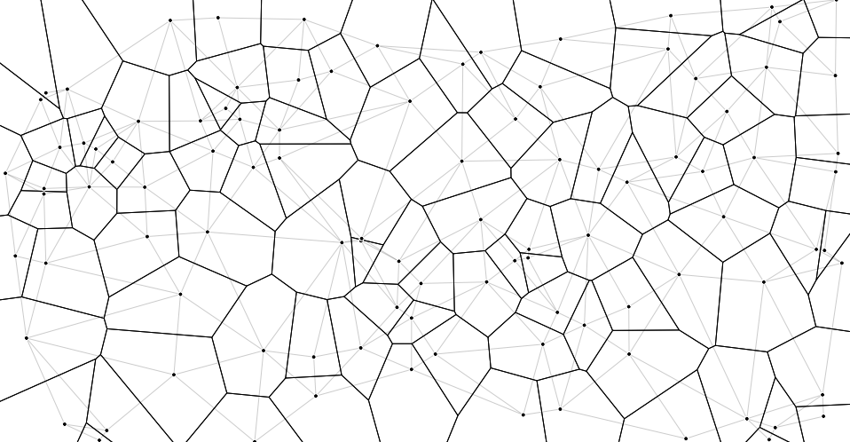

# Tessellation’s createApp

[](https://travis-ci.org/xaviervia/tessellation) [](https://www.npmjs.com/package/tessellation)

Tessellation is a Redux-inspired architecture for applications, front-end or otherwise. It is one of the simplest ways of getting started with React. Like Redux, it makes a clear separation between the state management in the store and the components, making it possible for your components to be stateless functions; but Tessellation doesn’t require a `connect`, so it’s easier for beginners and it makes bootstrapping a new app very straightforward.

This library provides a simple wrapper for a Redux-like store that incorporates support for [Tessellation’s Effect Wiring API](https://github.com/xaviervia/tessellation#effect-wiring-api). Please refer to the [complete thesis](https://github.com/xaviervia/tessellation) for more details on the why and how of this architecture.

## Installation

```
npm install --save tessellation
```

## Usage

A small counter app:

```javascript
import React from 'react'
import {createApp, renderEffect} from 'tessellation'

const reducer = (state, action) => {
  switch (action.type) {
    case 'ADD':
      return {
        ...state,
        value: state.value + 1
      }

    default:
      return state
  }
}

const initialState = {value: 0}

const effects = [
  renderEffect(
    function View ({push, value}) {
      return <div>
        <span>{value}</span>
        <button onClick={() => push({type: 'ADD'})}>
          Add
        </button>
      </div>
    },
    document.getElementById('root')
  ),

  () => (state) => console.log(state)
]

createApp(reducer, initialState, effects)
```

See this example in the [examples/counter](examples/counter/src/index.js) folder.

You can also find a [more complete app in here](https://github.com/xaviervia/tessellation/blob/master/variations/with-library/src/index.js). This other example is the [Tessellation thesis app](https://xaviervia.github.io/tessellation/) implemented using this library.

## Tessellation everywhere: on the server side, in a ServiceWorker, for CLIs, etc

A CLI counter app:

```javascript
const createApp = require('tessellation/createApp').default
const chalk = require('chalk')

const reducer = (state, action) => {
  switch (action.type) {
    case 'ADD':
      return Object.assign({}, state, {
        value: state.value + 1
      })

    default:
      return state
  }
}

const initialState = {value: 0}

const effects = [
  (push) => {
    process.stdin.on('data', () => {
      push({
        type: 'ADD'
      })
    })

    return (state) => {
      console.log('The counter value is:', chalk.red(state.value))
      console.log(chalk.gray(`Press ${chalk.white('ENTER')} to increase it`))
    }
  }
]

createApp(reducer, initialState, effects)
```

> See this example in [examples/cli-counter](examples/cli-counter/index.js)

Tessellation is a generalization of Redux. In Tessellation, the principle of a single store is used to drive the whole app, not just the UI. 

In order to achieve this it builds on top the [Effect Wiring API](https://github.com/xaviervia/tessellation#effect-wiring-api), which is a general interface for attaching side effects to the store. The Effect Wiring API is the core of the architecture, because it sets the pattern for how to deal with any kind of side effects in the same declarative manner. 

Note that if you want to build a server-side app or any other type of non-React/non-React DOM app, you have to require the `createApp` function directly. While the library provides out-of-the-box support for React with the `createRenderEffect` function, React and React DOM are included as peer dependencies and won’t be included in your code if you import `tessellation/createApp` directly.

In non-babel environments—such as plain Node—you will have to do:

```
const createApp = require('tessellation/createApp').default
```

…and voilà.

### You can use the pattern with Redux

**You don’t need to use this library**. Redux’s ecosystem is great and Tessellation doesn’t provide anything close to Redux DevTools. The central part of this library is the pattern used for the side effects. Tessellation could be described more as an extension of Redux than a replacement, much like Redux Saga or Redux Promise or any other of the many solutions built to work with non-React side effects in the Redux store. 

The way in which Tessellation differs from the other Redux extensions is that you don’t need a library to follow its pattern, so Tessellation is more of a demonstration of an architecture rather than a utility lib. The lib exists just to make implementation of the architecture easier, but you can safely ignore it.

This Effect Wiring API is fully compatible with Redux—see the [implementation of the thesis app using Redux](https://github.com/xaviervia/tessellation/blob/master/variations/redux/src/index.js)—which means that you can just apply the pattern to your Redux application and ignore this library altogether. This is how you would build the CLI Counter example with Redux:

```javascript
const {createStore} = require('redux')
const chalk = require('chalk')

const reducer = (state, action) => {
  switch (action.type) {
    case 'ADD':
      return Object.assign({}, state, {
        value: state.value + 1
      })

    default:
      return state
  }
}

const initialState = {value: 0}

const effects = [
  (push) => {
    process.stdin.on('data', () => {
      push({
        type: 'ADD'
      })
    })

    return (state) => {
      console.log('The counter value is:', chalk.red(state.value))
      console.log(chalk.gray(`Press ${chalk.white('ENTER')} to increase it`))
    }
  }
]

const {dispatch, subscribe, getState} = createStore(reducer, initialState)

const listeners = effects
  .map((effect) => effect(dispatch))
  .filter((listener) => listener != null)

const broadcast = () =>
  listeners
    .forEach((listener) => listener(getState()))

let prevState
subscribe(() => {
  broadcast()
  prevState = getState()
})

broadcast()
```

So these lines

```javascript

const {dispatch, subscribe, getState} = createStore(reducer, initialState)

const listeners = effects
  .map((effect) => effect(dispatch))
  .filter((listener) => listener != null)

const broadcast = () =>
  listeners
    .forEach((listener) => listener(getState()))

let prevState
subscribe(() => {
  broadcast()
  prevState = getState()
})

broadcast()
```

…and this line:

```javascript
createApp(reducer, initialState, effects)
```

…are equivalent.

## API

The library contains two functions:

- `createApp` is the analog to Redux’s `createStore`. It also takes a reducer as the first argument and an initial state as the second. The difference is that the third argument is the list of effects.
- `renderEffect` is the "connect" of Tessellation, similar to the React Redux `connect`. There are several important differences though:
  1. There is no `<Provider>` component. This means that only one component can be connected, and it has to be done at the root of the component tree.
  2. `renderEffect` renders directly to the DOM as well. In order to render to other targets (such as React Native) it would be necessary to implement other helpers.

### Type annotation

In pseudo-flowtype notation (`Action` is a [Flux Standard Action](https://github.com/acdlite/flux-standard-action)):

```typescript
type Push = (Action): void

type Effect = <State>(Push) => (State): void

createApp = <State>(
  reducer: (State, Action) => State,
  initialState: State,
  effects: Array<Effect>
): void

renderEffect(
  component: ReactComponent,
  target: DomElement
): Effect
```

## Credits

- Voronoi Tessellation artwork from [Mike Bostock’s d3-voronoi example](https://bl.ocks.org/mbostock/4060366)

## License

[The Unlicense](../../LICENSE)
